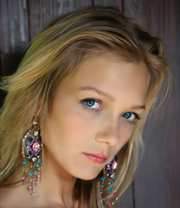
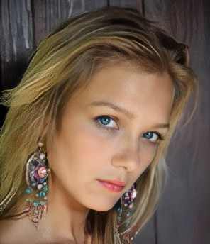
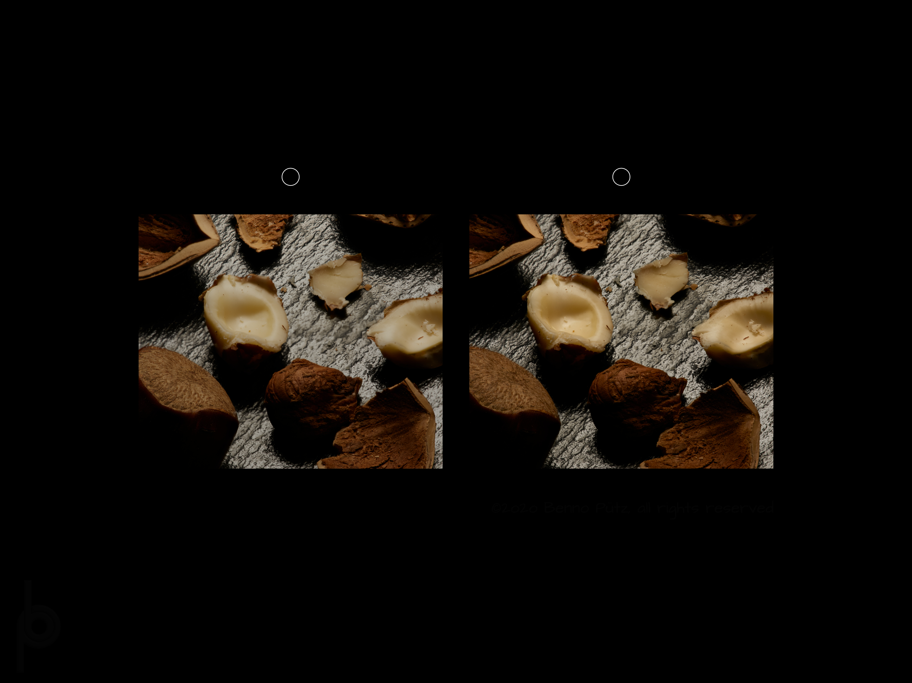
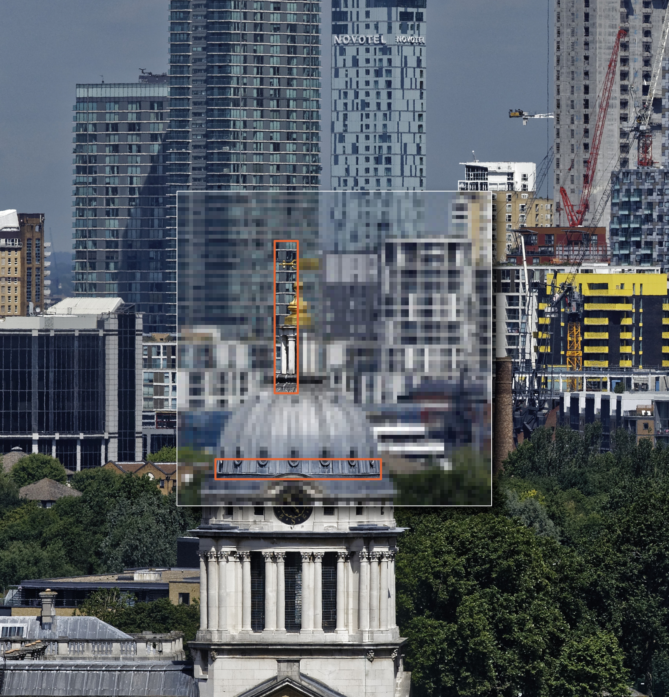

# Review Recap 2020-12-13

## Picture improvement / enlargement

### Links:
* Affinity Photo tutorial (thanks Michael Stapfer)

	https://www.youtube.com/watch?v=gTZ5eiQOob0

With a comparison of the two programs mentioned (did try myself yet)

* [Imglarger](imglarger.com) (web interface, cloud-based) - just created an account to try it

→ 

* Remini (mobile app, cloud-based)

	for iOS: https://apps.apple.com/de/app/remini-photo-enhancer/id1470373330?l=en

 → 

(Wanted to try on an enlarged version, too, but no conversion left for today on my free account)

The first version wins on hair, but I would hand it to remind on face (especially the eyes) and ear rings …

Both are limited in the picture size, though (even when paid for)

##Stereo images

Hope you can see the stereogram for the 3D effect - here is a page listing many methods to approach it: https://www.hidden-3d.com/how_to_view_stereogram.php In any way I recommend seeing it on black background.

Caveat: unfortunately, it does require *binocular vision* to see the 3D effect from the two images (beyond what is deducible from a single one). 

### Random stereograms

##Panoramic images

Just for reference a link to my London panorama at reduced height (500 pixels as imposed by the site, the original is ~42000×5200 pixels):

https://www.panorama-photo.net/panorama.php?pid=28490

And the resolution comparison I showed

## Tele test

Since I already prepared it, I’ll throw this in, too:

## Great conjunction

This s the link I stumbled upon last weekend - there are many more, it seems, but this was quite thorough and I like it being from a physics department ...

	https://www.youtube.com/watch?v=dbVpl9UYzHU

Have yet to see a clear night sky since, though, …

